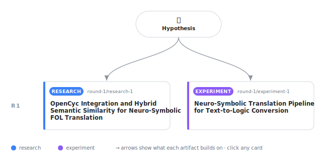

# Ontology-Grounded Semantic Unification with MDL-Based Pruning for Neuro-Symbolic Text-to-FOL Translation

<div align="center">

<a href="https://cdn.jsdelivr.net/gh/AMGrobelnik/ai-invention-a2051b-ontology-grounded-semantic-unification-w@main/workflow.svg">
<picture>
  <source media="(prefers-color-scheme: dark)" srcset="workflow-dark.svg">
  
</picture>
</a>

<sub>🖱️ <b><a href="https://cdn.jsdelivr.net/gh/AMGrobelnik/ai-invention-a2051b-ontology-grounded-semantic-unification-w@main/workflow.svg">Open the interactive diagram</a></b> — every card links to its artifact folder.</sub>

</div>

> **Hypothesis** — By combining OpenCyc taxonomic path-based semantic similarity with neural embeddings to create a hybrid fuzzy unification operator in Prolog, and using the Minimum Description Length (MDL) principle with ontological type constraints to prune extracted FOL clauses, we can significantly improve the accuracy and auditability of neuro-symbolic text-to-logic translation pipelines while reducing hallucination rates …

<details>
<summary>Full hypothesis</summary>

By combining OpenCyc taxonomic path-based semantic similarity with neural embeddings to create a hybrid fuzzy unification operator in Prolog, and using the Minimum Description Length (MDL) principle with ontological type constraints to prune extracted FOL clauses, we can significantly improve the accuracy and auditability of neuro-symbolic text-to-logic translation pipelines while reducing hallucination rates compared to pure neural or pure symbolic approaches.

</details>

This repository contains all **2 artifacts** produced across **1 round** of an autonomous AI research run — round by round, exactly in the order they were invented.

## Round 1

| Artifact | Type | Demo | Source | Builds on |
|----------|------|------|--------|-----------|
| **[OpenCyc Integration and Hybrid Semantic Similarity for Neuro…](https://github.com/AMGrobelnik/ai-invention-a2051b-ontology-grounded-semantic-unification-w/tree/main/round-1/research-1)** | [](https://github.com/AMGrobelnik/ai-invention-a2051b-ontology-grounded-semantic-unification-w/tree/main/round-1/research-1) | [](https://github.com/AMGrobelnik/ai-invention-a2051b-ontology-grounded-semantic-unification-w/blob/main/round-1/research-1/demo/research_demo.md) | [](https://github.com/AMGrobelnik/ai-invention-a2051b-ontology-grounded-semantic-unification-w/tree/main/round-1/research-1/src) | — |
| **[Neuro-Symbolic Translation Pipeline for Text-to-Logic Conver…](https://github.com/AMGrobelnik/ai-invention-a2051b-ontology-grounded-semantic-unification-w/tree/main/round-1/experiment-1)** | [](https://github.com/AMGrobelnik/ai-invention-a2051b-ontology-grounded-semantic-unification-w/tree/main/round-1/experiment-1) | [](https://colab.research.google.com/github/AMGrobelnik/ai-invention-a2051b-ontology-grounded-semantic-unification-w/blob/main/round-1/experiment-1/demo/method_code_demo.ipynb) | [](https://github.com/AMGrobelnik/ai-invention-a2051b-ontology-grounded-semantic-unification-w/tree/main/round-1/experiment-1/src) | — |

## Repository Structure

Artifacts are grouped by the round of invention that produced them. Each
artifact has its own folder with source code and a self-contained demo:

```
.
├── round-1/                         # One folder per round of invention
│   ├── experiment-1/
│   │   ├── README.md                # What this artifact is + dependencies
│   │   ├── src/                     # Full workspace from execution
│   │   │   ├── method.py            # Main implementation
│   │   │   ├── method_out.json      # Full output data
│   │   │   └── ...                  # All execution artifacts
│   │   └── demo/                    # Self-contained demo
│   │       └── method_code_demo.ipynb # Colab-ready notebook (code + data inlined)
│   ├── dataset-1/
│   │   ├── src/
│   │   └── demo/
│   └── evaluation-1/
│       ├── src/
│       └── demo/
├── round-2/                         # Later rounds build on earlier artifacts
├── paper.pdf                        # Research paper
├── paper_latex/                     # LaTeX source files
├── workflow.svg                     # Artifact dependency diagram (this page's header)
└── README.md
```

## Running Notebooks

### Option 1: Google Colab (Recommended)

Click the "Open in Colab" badges above to run notebooks directly in your browser.
No installation required!

### Option 2: Local Jupyter

```bash
# Clone the repo
git clone https://github.com/AMGrobelnik/ai-invention-a2051b-ontology-grounded-semantic-unification-w
cd ai-invention-a2051b-ontology-grounded-semantic-unification-w

# Install dependencies
pip install jupyter

# Run any artifact's demo notebook
jupyter notebook <artifact_folder>/demo/
```

## Source Code

The original source files are in each artifact's `src/` folder.
These files may have external dependencies - use the demo notebooks for a self-contained experience.

---
*Generated by AI Inventor Pipeline - Automated Research Generation*
